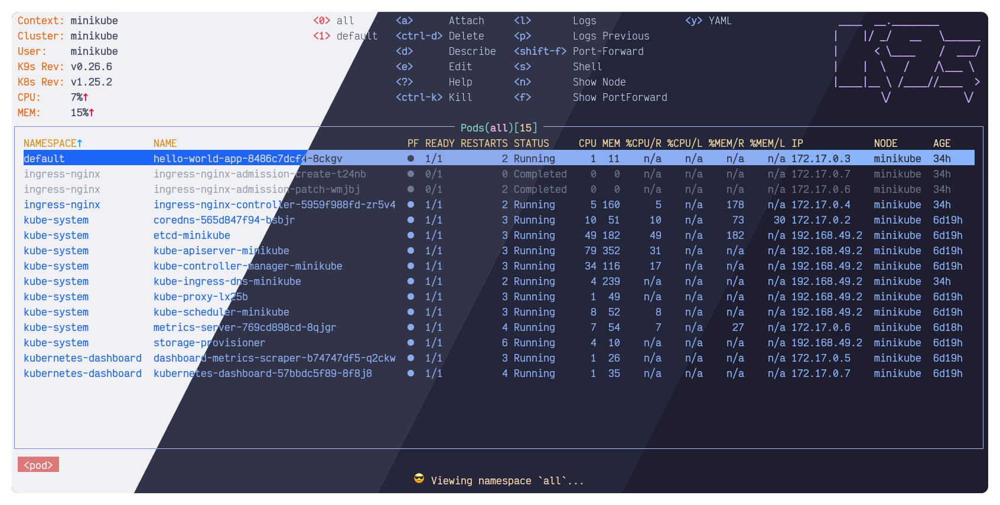
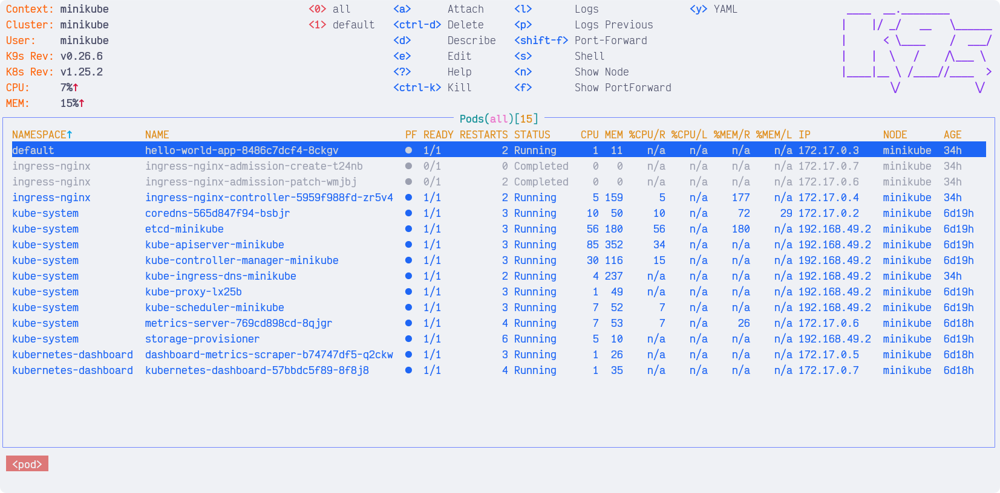
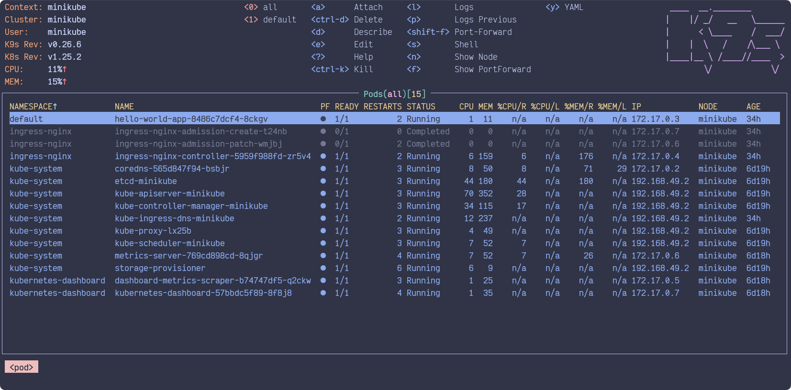
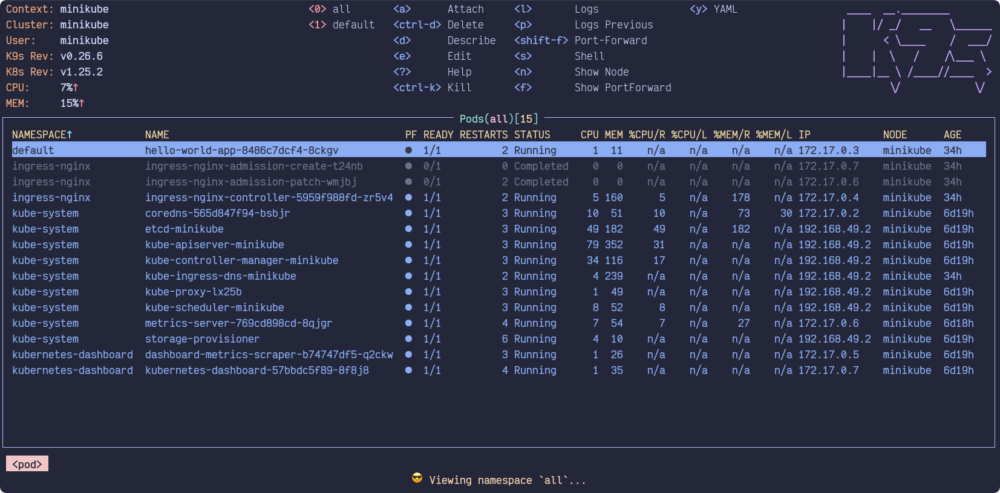
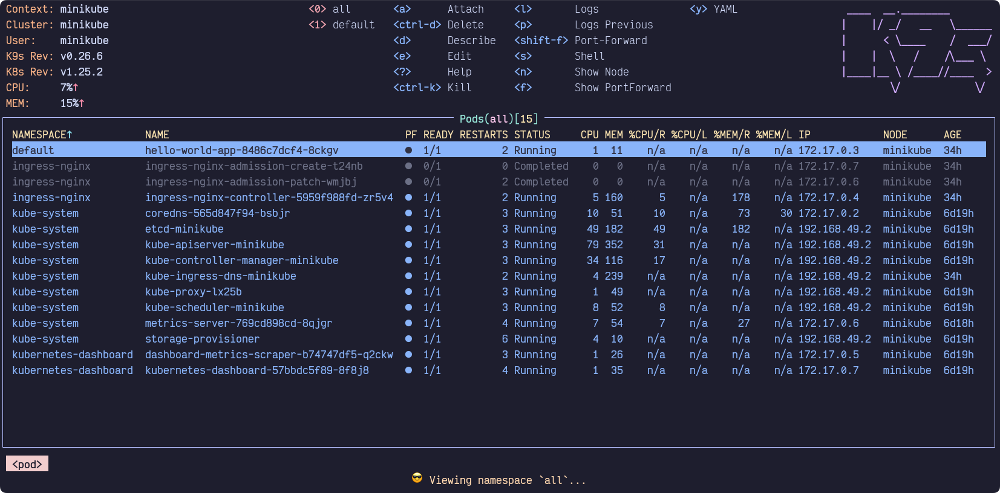

<h3 align="center">
  <br/>
  
  Catppuccin for <a href="https://github.com/derailed/k9s">k9s</a>
  
</h3>

<p align="center">
  <a href="https://github.com/catppuccin/k9s/stargazers"></a>
  <a href="https://github.com/catppuccin/k9s/issues"></a>
  <a href="https://github.com/catppuccin/k9s/contributors"></a>
</p>

<p align="center">
  
</p>

## Previews

<details>
  <summary>🌻 Latte</summary>
  
</details>
<details>
  <summary>🪴 Frappé</summary>
  
</details>
<details>
  <summary>🌺 Macchiato</summary>
  
</details>
<details>
  <summary>🌿 Mocha</summary>
  
</details>

## Usage


1. Download the theme files & copy them into your k9s skins directory.

### Linux
```bash
OUT="${XDG_CONFIG_HOME:-$HOME/.config}/k9s/skins"
mkdir -p "$OUT"
curl -L https://github.com/catppuccin/k9s/archive/main.tar.gz | tar xz -C "$OUT" --strip-components=2 k9s-main/dist
```

### macOS
```bash
OUT="${XDG_CONFIG_HOME:-$HOME/Library/Application Support}/k9s/skins"
mkdir -p "$OUT"
curl -L https://github.com/catppuccin/k9s/archive/main.tar.gz | tar xz -C "$OUT" --strip-components=2 k9s-main/dist
```

2. Edit your `config.yaml` so that it sets `k9s.ui.skin` to a Catppuccin flavor.
```yaml
k9s:
  ui:
    skin: catppuccin-mocha
    # ...or another flavor:
    # skin: catppuccin-macchiato
    # skin: catppuccin-frappe
    # skin: catppuccin-latte

    # ...or the transparent variants:
    # skin: catppuccin-mocha-transparent
    # skin: catppuccin-macchiato-transparent
    # skin: catppuccin-frappe-transparent
    # skin: catppuccin-latte-transparent
```

## 💝 Thanks to

- [Jeff Davis](https://github.com/JefeDavis)
- [winston](https://github.com/nekowinston)

&nbsp;

<p align="center">
  
</p>

<p align="center">
  Copyright &copy; 2021-present <a href="https://github.com/catppuccin" target="_blank">Catppuccin Org</a>
</p>

<p align="center">
  <a href="https://github.com/catppuccin/catppuccin/blob/main/LICENSE"></a>
</p>
